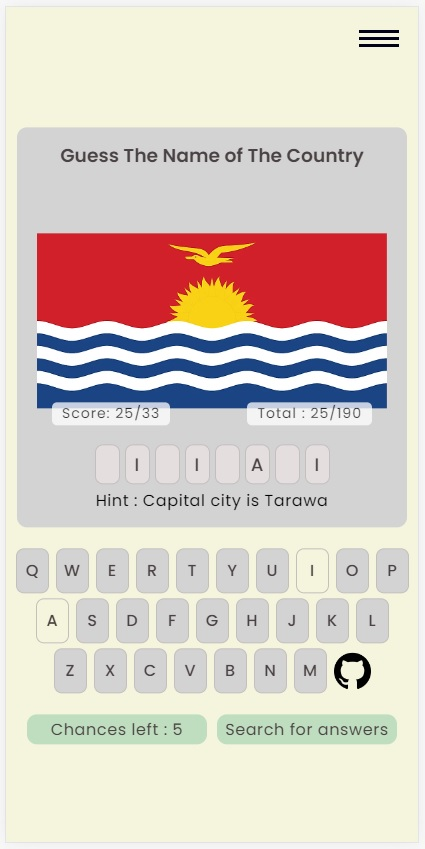

# Guess That Country
an attempt to design a mini game using HTML, CSS & JavaScript
 
Web mini game [Guess That Country](https://guess-that-country.netlify.app/)
 
to view brief explanation : https://www.youtube.com/watch?v=GODOeqGMnOU
 

 
## Features coded
* use of API consists of 190 countries
* use of localStorage to enable resumption on browser reload
* internal JSON generated to store the results list

## Game rules
* 1 guess attempt per country
* 5 chances of guess attempts (4 wrong guesses maximum)
* guess results are listed in slide in menu

